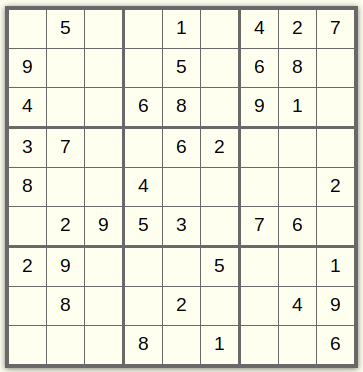
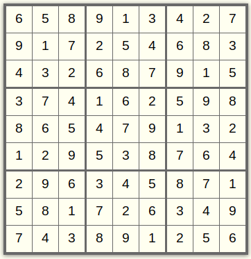

# Sudoku Solver

This is a Haskell implementation of Richard Bird's Sudoku Solver from
[Pearls of Functional Algorithm Design](https://dl.acm.org/doi/book/10.5555/1951654).

The solver essentially works at the row level. In order to work with columns and
3 x 3 internal boxes of the grid as rows, they first need to be transformed into
rows. Then they need to be restored. This is possible due to the properties that
these transformations have.

The work done on each row (columns and boxes) is:

- Fill unknown cells with all the choices of available digits.
- Remove fixed digits from these cell choices.
- Find the first cell with a minimum (more than 1) choices.
- Expand that single cell into matching choice matrices.
- Recurse into each expanded 'Matrix', searching for the next minimum cell to prune & expand.
- Stop when either an invalid 'Matrix' or a solution 'Matrix' containing only 'singleton' cells is found.

The code includes several helper functions that deal with the different aspects
of the Sudoku puzzle, such as `safe`, which checks if a given matrix is safe
(i.e., there are no duplicates in any of the rows, columns, or boxes), and
`complete`, which checks if a given matrix is complete (i.e., it only contains
singleton cells). Other helper functions include `choices`, which fills in
unknown cells with all the choices of available digits, and `expand1`, which
expands the smallest single cell of a matrix of choices. The `search` function
is the main function that solves the puzzle by searching for valid solutions
given a matrix of choices.

The code also includes properties that apply to 'rows', 'cols', 'boxs', 'group',
and 'ungroup'. For example, `rows ∘ rows = id`, which means that `rows (rows a)
= a`. Similarly, `cols ∘ cols = id`, which means that `cols (cols a) = a. boxs ∘
boxs = id` means that `boxs (boxs a) = a`, and `ungroup ∘ group = id`.

## Build

To build this application, run:

```bash
make clean setup check build
```

## Documentation

API documentation is available from GitLab pages,
[here](https://frankhjung1.gitlab.io/haskell-sudoku/).

## Example

Run example Sudoku solver against puzzle read from a file:

```bash
stack exec sudoku -- data/easy.sudoku
```

This is an easy Sudoku puzzle:



With a solution of



## References

- [Pearls of Functional Algorithm Design](https://dl.acm.org/doi/book/10.5555/1951654)
- [Wikipedia Sudoku](https://en.wikipedia.org/wiki/Sudoku)
- [Sudoku I: First Steps](https://youtu.be/glog9DZh8G0)
- [Sudoku II: Initial Solvers](https://youtu.be/O1-ruHzabAU)
- [Sudoku III: Improving Performance](https://youtu.be/ESDpXBd1cJM)
